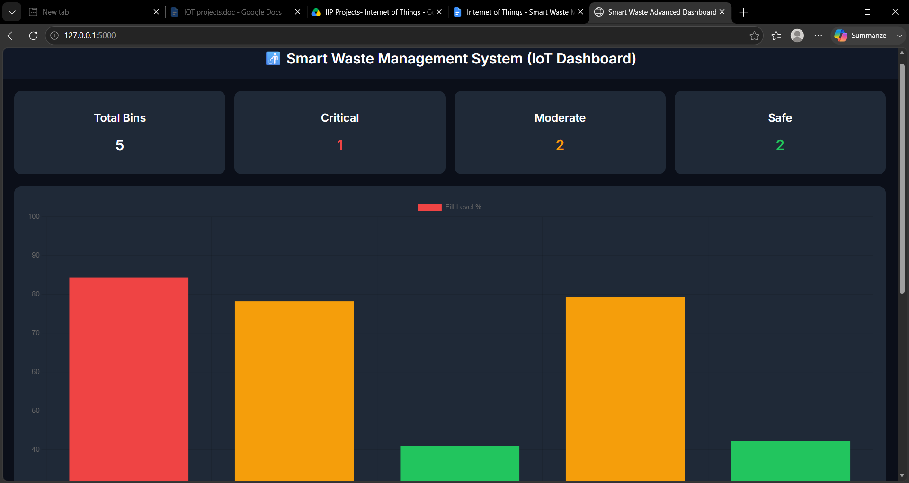
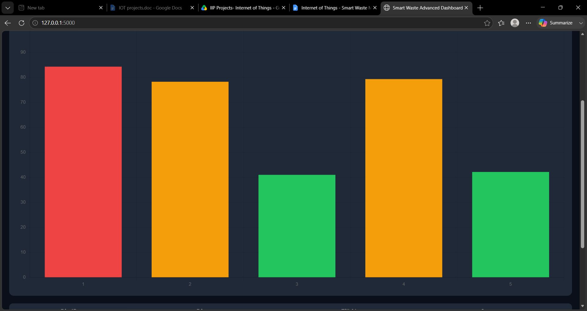
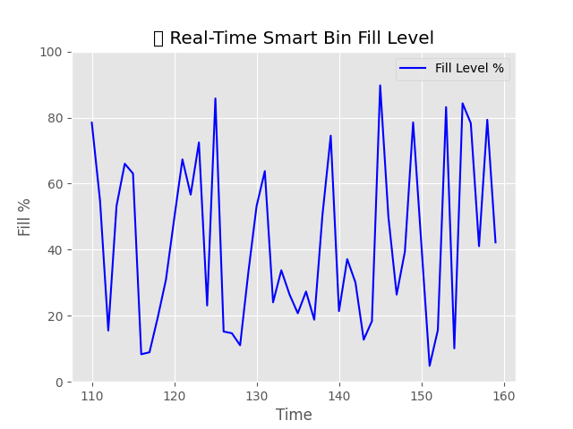
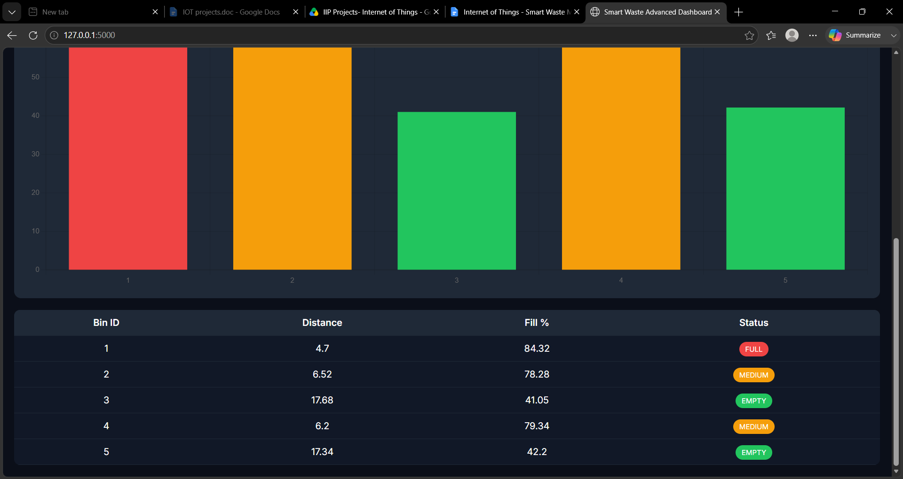

# 🚮 Smart Waste Management & Bin Level Detection System (IoT + AI + Dashboard)

## 🌍 Overview
This project is an IoT-inspired Smart Waste Management System that simulates real-time garbage bin monitoring using Python. It tracks bin fill levels, generates analytics, displays a live dashboard, provides AI-based prediction, and visualizes bins on a smart city map.

It is designed as a **portfolio-level IoT + AI + Smart City project**.

---

## 🎯 Features

- 📊 Real-time Flask Dashboard (Dark UI)
- 📈 Live Charts using Chart.js
- 🗺️ Smart City Map Visualization (Folium)
- 🤖 AI-based Bin Fill Prediction
- 📡 MQTT IoT Simulation
- 📱 Fully Mobile Responsive UI
- ⚡ Auto-refresh Live Monitoring
- 📁 CSV-based Data Logging
- 🧠 Analytics Engine

---

## 🛠️ Tech Stack

- Python 3
- Flask
- Pandas
- NumPy
- Scikit-learn
- Chart.js
- Folium
- MQTT (paho-mqtt)
- HTML + CSS

---

## 🏗️ System Architecture

Sensor Simulation → Data Logger → Analytics → AI Prediction → Flask Dashboard → Map Visualization → Alerts System

---

## 🚀 How to Run

### Install Dependencies
```bash
pip install flask pandas numpy scikit-learn folium paho-mqtt
Generate Data
python python_simulation/advanced_simulator.py
Run Dashboard
python python_simulation/live_dashboard.py

Open:

http://127.0.0.1:5000
Run AI Module
python python_simulation/ai_predictor.py
Run Map View
python python_simulation/map_view.py

Open:

outputs/smart_city_map.html
📸 Screenshots
## 📸 Screenshots

### 📊 Dashboard


### 📈 Charts


### 🗺️ Map View


### 🤖 AI Prediction

🚀 Future Improvements
Real ESP32 hardware integration
Google Maps live tracking
Mobile app version
Cloud deployment
Route optimization
👨‍💻 Author

Smart IoT Project | Student Portfolio Project